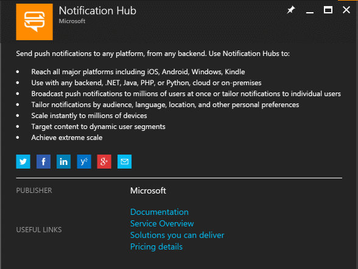
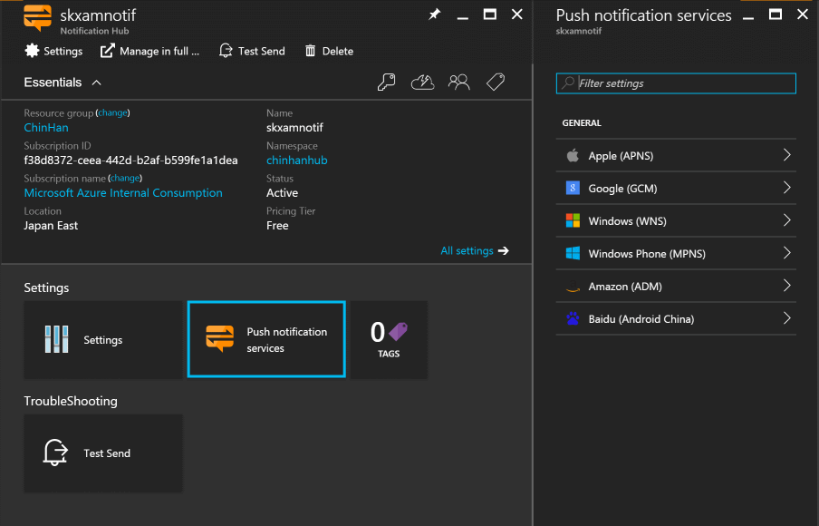
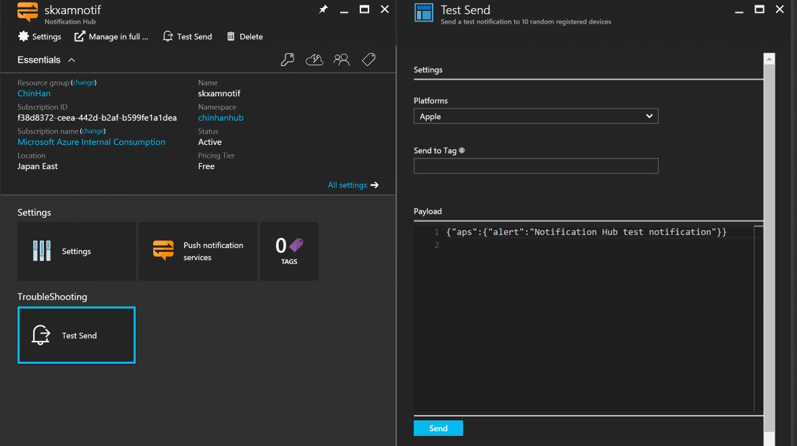
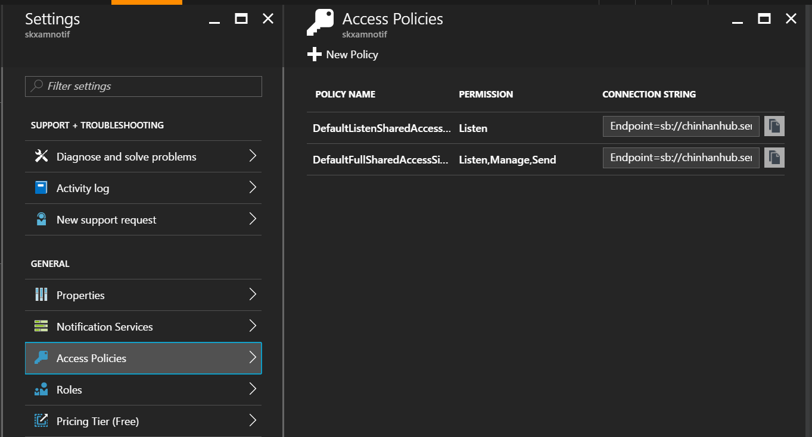

# 在 Microsoft Azure 建立 Azure 通知中樞

Azure Notification Hubs 是整個推播通知的核心，它可以處理主流的應用程式推播服務，讓應用程式的開發人員可以簡化處理推播服務的實作，更快完成推播通知的功能開發。

## 操作步驟

1. 在 [Azure 管理後台](https://portal.azure.com/) 選擇 _新增服務_ ，然後搜尋 **Notification Hub** 點選建立開始建立服務。

    

2. 填寫 _Hub name_、_namespace_、資源群組名稱、以及服務在開在哪個 Azure 機房，價格方案可以先選擇 **Free** 就可以了，最後開始建立 Azure Notification Hub 的服務。

3. 在 Azure Notification Hub 中，你可以設定各種推播服務的金鑰或憑證，同時也能直接在管理後台上測試推播訊息。

    
    _圖: 支援多種推播通知_

    
    _圖: 測試發送推播訊息_

4. 在 Azure Notification Hub 中的 _Settings_ 頁面找到 **Access Policeis** 的設定頁面，這裡可以產生不同權限的連線字串，比方說行動裝置端若只收訊息則只要 _Listen_ 的權限即可。

    
    _圖: Azure Notification Hub 的存取原則及連線字串_
